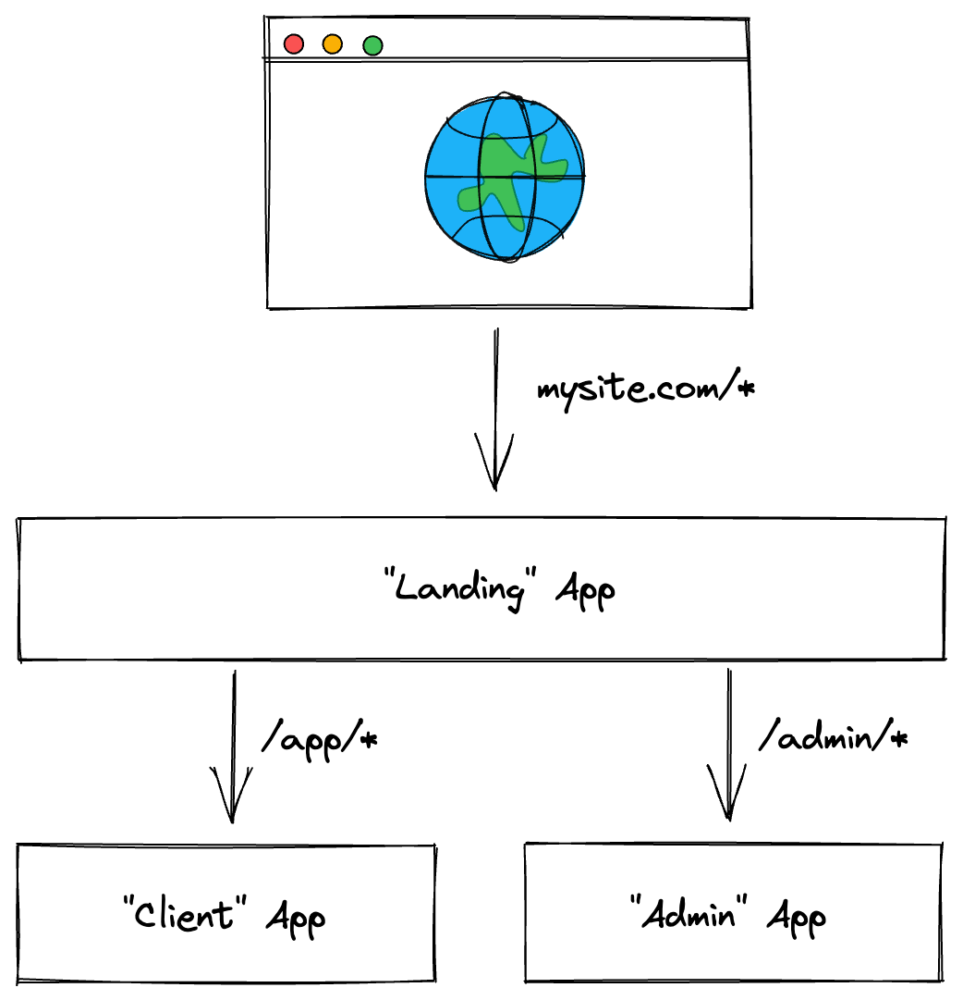

# "Micro-frontends": NextJS Zones

This repo is an exploration of "micro-frontends" using [NextJS Zones](https://nextjs.org/docs/advanced-features/multi-zones).

[Vercel's documentation](https://nextjs.org/docs/advanced-features/multi-zones) describes Zones as follows:

> A zone is a single deployment of a Next.js app. You can have multiple zones and merge them as a single app.

The core idea of Zones is to have individually-deployed Next.js sites that are "stitched" together under a single domain name, as illustrated below.

  

Calling such a setup a "single app" can be a bit misleading – as it depends on your definition of an "app". With Next.js Zones, you can have multiple Next.js apps deployed under a single domain name – however, navigating between the different Next.js apps results in "hard" page loads. The collection of Next.js apps are not merged into a single single-page app on the client.

To read more about this experiment, check out... (TODO: link to future blog post). This repo is deployed and live [here](https://showcase-nextjs-zones.formidable.dev/) if you'd like to poke around with the end result.
